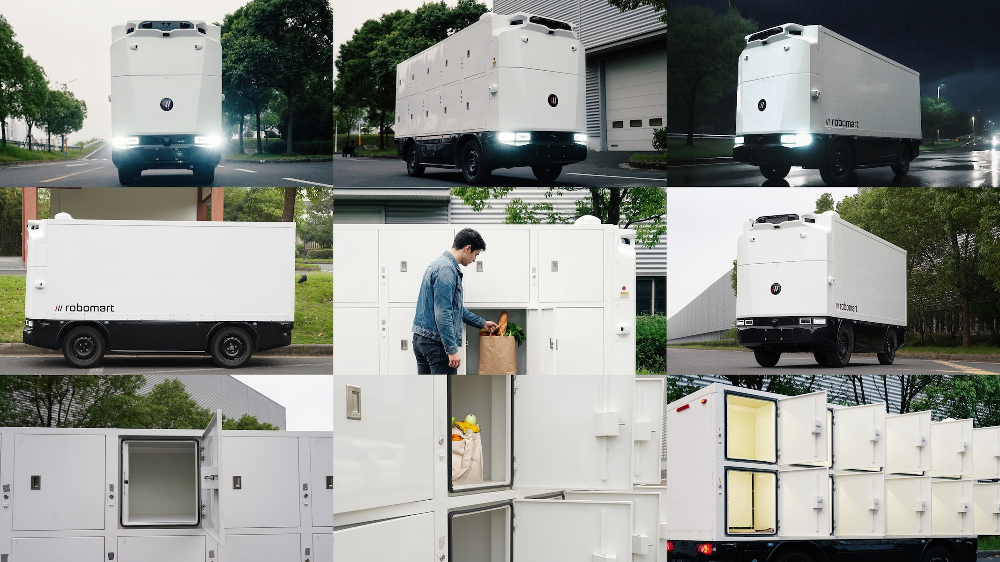
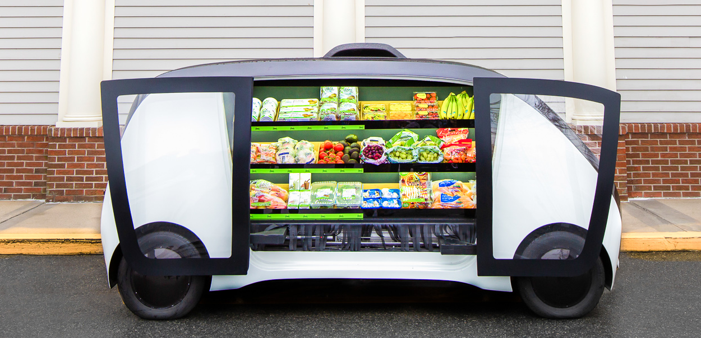
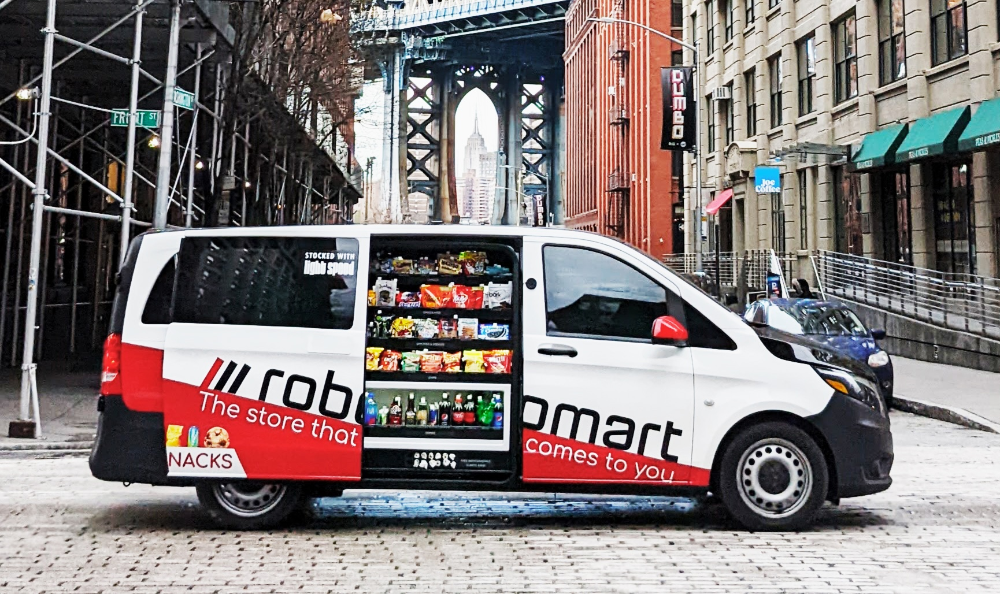
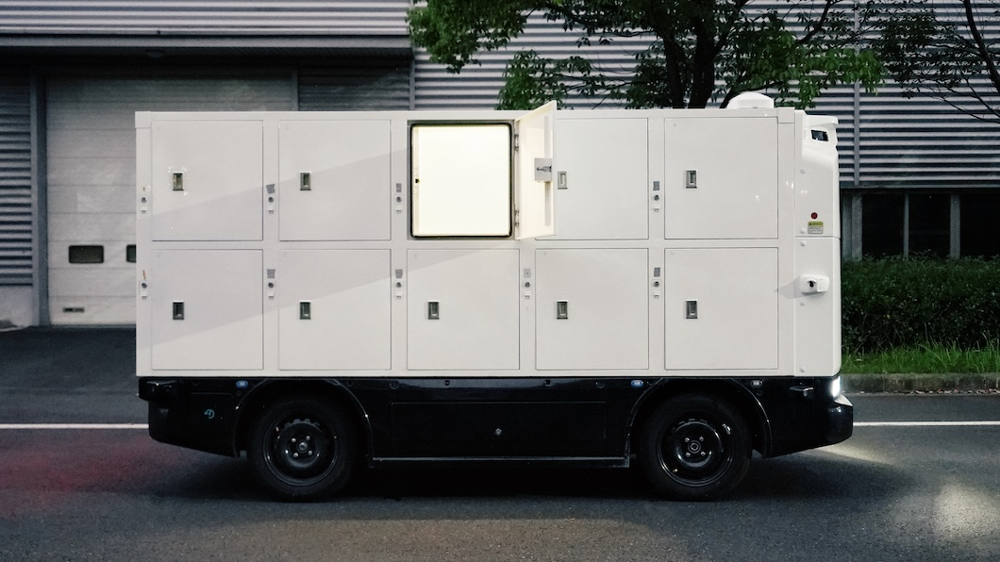

# Robomart

**Autonomy Delivered.**

Robomart is a robotics and AI company building the future of autonomous delivery. Based in Glendale, CA, with offices in Austin, Baltimore, and San Francisco, Robomart is the creator of the world's first self-driving store and the most advanced autonomous delivery robots on the road today. Founded in 2017, Robomart pioneered store-hailing — bringing entire mobile shops directly to customers' doors — and is now redefining on-demand delivery with the RM5, a fully autonomous delivery platform engineered to make food and grocery delivery profitable.

---

## The Problem

Retailers lose money on virtually every on-demand delivery today. Consumers pay exorbitant fees — often 40% of order value in markups, service fees, and tips. Drones and sidewalk bots attempt to solve this through automation but are constrained by extremely limited payload capacity and narrow operating domains.

What delivery needs is large, road-going autonomous vehicles with high payload, multi-store batching, and multiple compartments.

## The Solution

Robomart has spent nearly a decade engineering the answer: purpose-built, fully autonomous delivery robots that bring the cost of delivery down by up to 70% compared to human labor, with up to 50x more capacity than drones and bots.

The RM5 is our fifth-generation vehicle — driverless, passengerless, road-going, and designed from first principles to make on-demand delivery profitable for retailers and affordable for consumers.

---

## RM5

The RM5 is a Level 4 fully autonomous delivery robot — purpose-built, not adapted from a passenger car.

- **Autonomy:** Level 4 fully self-driving, powered by Robomind
- **Top Speed:** 25 mph (low-speed vehicle classification)
- **Payload:** 500 lbs across 10 temperature-controlled lockers
- **Batching:** Multiple orders from multiple retailers on a single run
- **Cost Reduction:** Up to 70% lower delivery cost vs. human labor
- **Capacity:** Up to 50x more than drones and sidewalk bots
- **Weather:** Light to heavy rain, light snow, heavy winds, light to moderate fog
- **Operation:** Day and night

## From Gala to RM5

Robomart has been building autonomous delivery vehicles since 2018 — five generations of hardware, each informed by real-world operation.

**Gala** (2018) was the world's first self-driving store — a full mobile shop that customers could hail to their door. It proved the concept and put Robomart on the map.

**First generation** — Robomart's mobile store on the streets of Brooklyn. A retrofitted Metris van packed with shelves of goods, branded with the original tagline: *The store that comes to you.*

**RM5** (2025) is the culmination of five generations of iteration. Purpose-built from the ground up for autonomous delivery at scale — no retrofitted vans, no adapted passenger cars. Every design decision optimized for safety, payload, and unit economics.

---

## Core Technology

### Robomind

Robomart's proprietary Level 4 full self-driving system. Robomind is the autonomous intelligence behind every RM5 — governing perception, decision-making, motion planning, and vehicle control.

- **Sensor suite:** LiDAR, surround-view cameras, ultrasonic sensors, and auxiliary proximity sensors. Full 360-degree coverage with no blind spots.
- **Perception:** Real-time detection and classification of vehicles, pedestrians, cyclists, mobility devices, traffic signals, road signs, and construction zones. Conservative buffers around vulnerable road users with early yielding behavior.
- **Track record:** 99.4% system uptime to date. Zero critical incidents. Years of pilot deployments with major partners across diverse weather and lighting conditions.

### Autofleet

Robomart's fleet intelligence system. Autofleet handles real-time vehicle dispatch, route optimization, multi-store order batching, and fleet-wide health monitoring. The Robomart Command Center provides continuous oversight of every RM5 — live telemetry, localization, sensor health, and authenticated camera feeds. Fleet Observers are on duty at all times.

### Auto-Checkout

Robomart's autonomous commerce layer. Auto-Checkout manages the end-to-end transaction between robot, retailer, and customer — from order assignment through locker access to delivery confirmation. Authenticated lock/unlock for store staff and customers, temperature-controlled compartment management, and real-time order status.

---

## Safety

Safety is Robomart's highest priority. The RM5 is purpose-built for delivery — not adapted from a passenger car — which means safety is the central design element, not a constraint.

> A geofenced, zero-occupant vehicle limited to 25 mph, engineered with low kinetic energy and no passenger-protection tradeoffs, ensuring pedestrians, cyclists, and nearby vehicles remain the top priority in every scenario.

- Zero occupants: No driver, no passengers. No trolley problem. The vehicle always prioritizes people outside it.
- Low speed: 25 mph max, ~7x lower kinetic energy than highway speeds.
- Geofenced: Mapped zones only. Never on highways or roads above 45 mph.
- Redundant architecture: Redundant control units with independent power sources. No single-point failures.
- Hardwired collision sensors: Front, side, and rear contact detection triggers immediate stops independent of the autonomous software.
- Minimal risk condition: On any fault — sensor, connectivity, environment — the vehicle executes a controlled safe stop, activates hazard lights, and notifies ops.
- Crashworthiness: Lightweight body engineered for controlled deformation to protect pedestrians and cyclists.

Testing follows a rigorous phased approach: simulation, then private test tracks, then limited geofenced areas, before any public deployment. Every software update undergoes structured testing with rollback protections.

---

## Robomart Connect

**Autonomous delivery as a service.**

Robomart Connect is the platform that opens the Robomart fleet to retailers, merchants, and developers. A single integration point to dispatch, track, and manage autonomous deliveries — no fleet to build, no drivers to hire, no vehicles to maintain.

- Fleet dispatch — Request the nearest available RM5 on demand
- Order management — Qualify orders, assign vehicles, batch across retailers
- Locker access — Authenticated lock/unlock for store staff and customers
- Delivery tracking — Real-time vehicle location, ETA, and status updates
- Telemetry — Live vehicle health, route progress, and delivery confirmation

### How It Works

1. Partner's app sends an order via Connect
2. Connect qualifies the order and assigns an RM5
3. RM5 autonomously routes to the store, parks at a designated pickup bay
4. Store staff swipes to unlock the relevant locker and loads the order
5. Customer gets notified on arrival and swipes to unlock their locker
6. Delivery confirmed, vehicle returns to fleet

Partners keep their own apps, their own brand, their own customer relationship. Robomart Connect handles the autonomous delivery behind it. [Conjure](https://github.com/conjureing) is the first application built on Robomart Connect.

---

## Partners

Robomart has partnered with global brands to further its mission of delivering autonomy:

- Ahold Delhaize
- Unilever
- Mars
- Avery Dennison
- NVIDIA
- Yamaha Motors

## Backed By

Venture backed with millions in funding from:

- Hustle Fund
- Wasabi Ventures
- W Ventures
- Entrepreneur Ventures
- Capital Factory
- HAX

## Learn More

[robomart.ai](https://robomart.ai)
